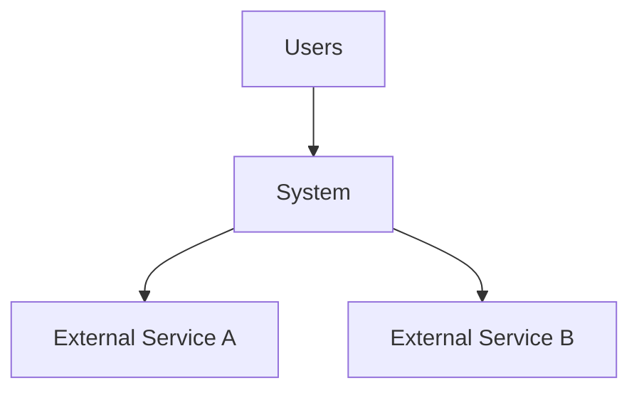
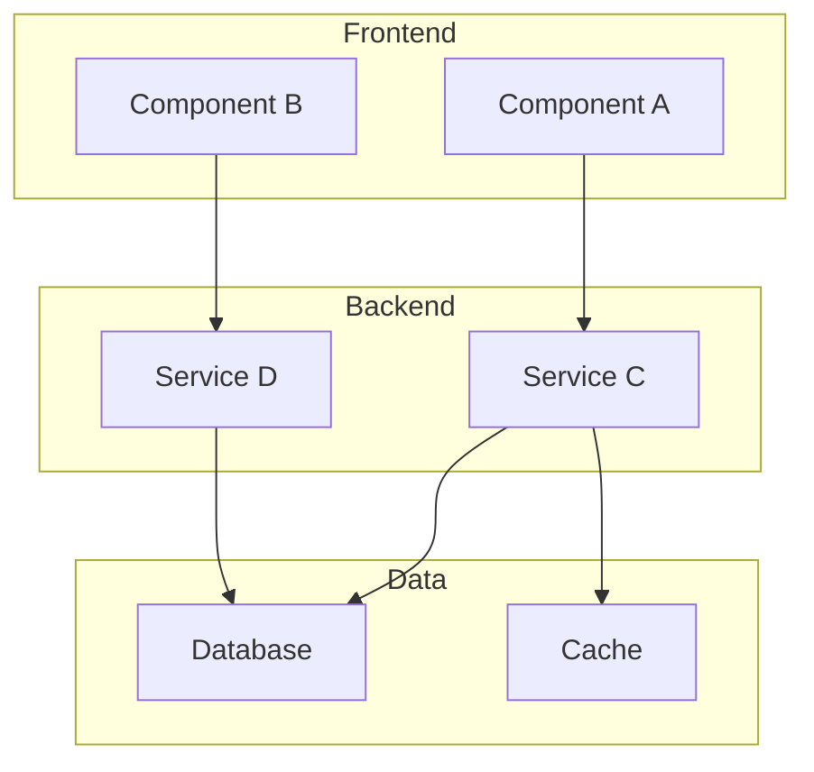
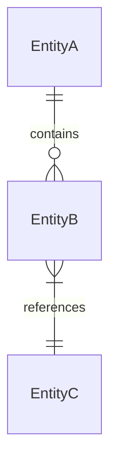
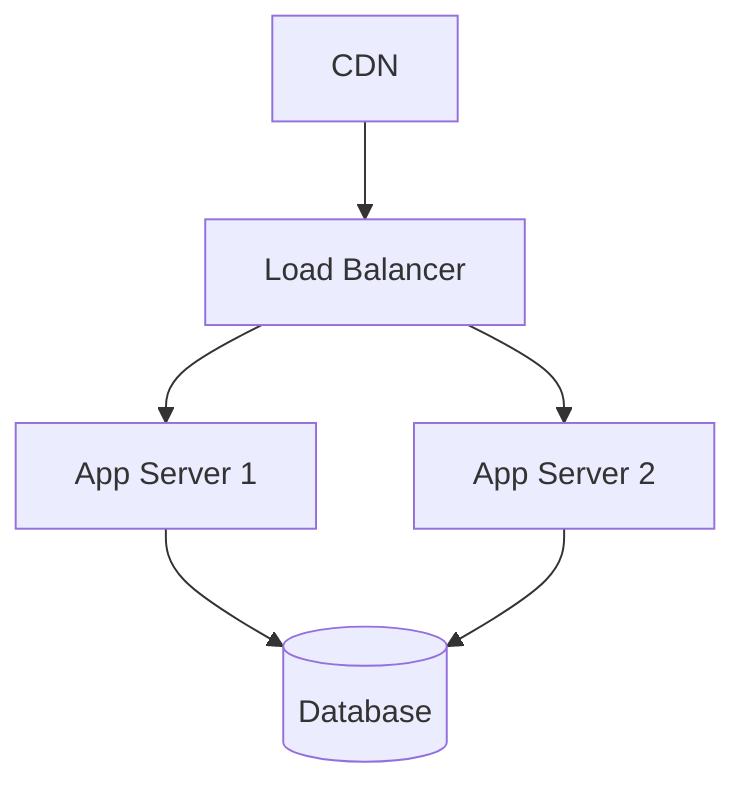

# Technical Architecture Document Template

```markdown
---
title: "[Project Name] — Technical Architecture"
status: draft
created: YYYY-MM-DD
updated: YYYY-MM-DD
authors: [name]
tags: [architecture, system-design, infrastructure]
links:
  - type: satisfies
    target: requirements.md
---

# Technical Architecture

## 1. Overview

One-paragraph summary of the system architecture. What kind of system is this (monolith, microservices, serverless, hybrid)? What are the primary design goals (scalability, simplicity, real-time, cost efficiency)?

## 2. Architecture Goals & Constraints

### Goals

Prioritized list of architectural qualities this design optimizes for. Reference the non-functional requirements from the [SRS](requirements.md).

### Constraints

Technology mandates, budget limits, team skill constraints, timeline constraints, regulatory requirements. These are non-negotiable inputs to the design.

### Trade-Offs

Explicit trade-offs made. For each, link to the ADR that documents the decision:
- [Trade-off description] — see [ADR-NNN](adrs/NNN-title.md).

## 3. System Context

How the system interacts with external actors and systems.



Describe each external dependency: what it provides, how it's accessed, what happens if it's unavailable.

## 4. Component Architecture

### High-Level Decomposition



### Component Descriptions

For each component:

#### [Component Name]

- **Responsibility**: What this component does (single responsibility).
- **Technology**: Language, framework, runtime.
- **Interfaces**: What it exposes and what it consumes.
- **Data owned**: What data this component is authoritative for.
- **Scaling strategy**: How it scales (horizontal, vertical, not applicable).
- **Key ADRs**: Decisions that shaped this component.

## 5. Data Architecture

### Data Model Overview

High-level entity relationship diagram. Link to the [Domain Model](domain-model.md) for detailed entity definitions.



### Data Flow

How data moves through the system for key operations. Use sequence diagrams for critical paths.

### Storage Strategy

| Data Type | Store | Rationale | Retention |
|----------|-------|-----------|-----------|
| | | | |

### Data Migration Strategy

How schema changes are managed. Tooling, rollback approach, zero-downtime requirements.

## 6. Technology Stack

| Layer | Technology | Version | Rationale | ADR |
|-------|-----------|---------|-----------|-----|
| Frontend | | | | |
| Backend | | | | |
| Database | | | | |
| Infrastructure | | | | |
| CI/CD | | | | |

## 7. Security Architecture

### Authentication & Authorization

Model, protocols, token management. Link to relevant ADRs.

### Data Protection

Encryption at rest and in transit. Key management. PII handling.

### Network Security

Firewalls, VPCs, ingress/egress rules, DDoS mitigation.

### Threat Model

Known attack vectors and mitigations. Reference security requirements from the [SRS](requirements.md).

## 8. Infrastructure & Deployment

### Deployment Topology



### Environments

| Environment | Purpose | URL | Configuration |
|------------|---------|-----|--------------|
| Development | | | |
| Staging | | | |
| Production | | | |

### CI/CD Pipeline

Build, test, deploy stages. Approval gates. Rollback triggers.

## 9. Cross-Cutting Concerns

### Logging & Observability

Log format, aggregation strategy, tracing, metrics collection.

### Error Handling

Error taxonomy, retry strategies, circuit breakers, dead letter queues.

### Configuration Management

How config is managed across environments. Feature flags. Secrets management.

### Performance Optimization

Caching strategy, CDN usage, database indexing approach, query optimization.

## 10. Evolution & Migration Path

How the architecture is expected to evolve. Known scaling bottlenecks and their planned solutions. Technology sunset plans.

## Appendices

- Glossary: Link to [Domain Model](domain-model.md).
- Related documents: [Vision](vision.md), [Requirements](requirements.md), [Operations](operations.md).
- ADR Index: Link to [ADR directory](adrs/).
```
