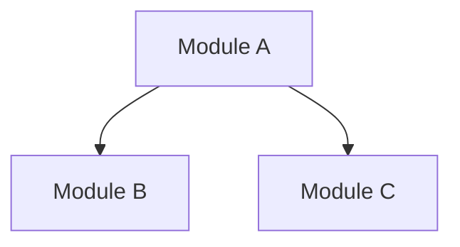
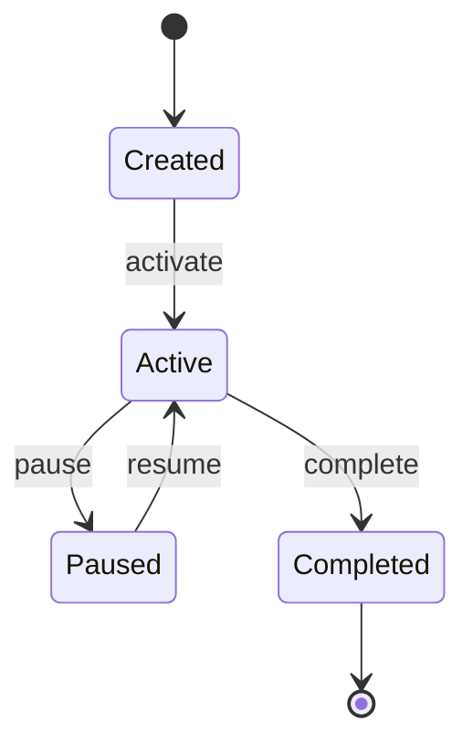
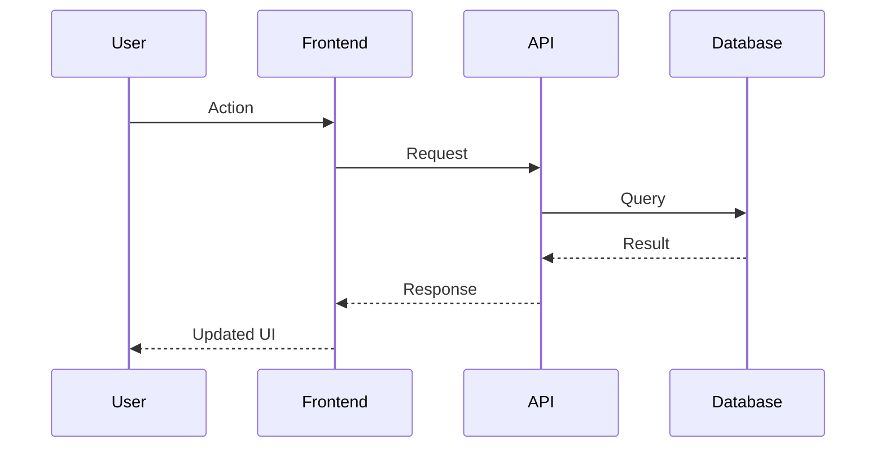

# Technical Design Specification Template

Design specs bridge architecture and implementation. One per major feature or system component. More detailed than an ADR, more focused than the architecture doc.

```markdown
---
title: "[Feature/Component Name] — Design Specification"
status: draft
created: YYYY-MM-DD
updated: YYYY-MM-DD
authors: [name]
tags: [design, feature-name]
links:
  - type: satisfies
    target: ../requirements.md#REQ-NNN
  - type: decided-by
    target: ../adrs/NNN-title.md
---

# [Feature/Component Name] — Design Specification

## 1. Overview & Objectives

What is being built. Why it matters. Specific success criteria (measurable).

### Requirements Satisfied

| Requirement | Description | Priority |
|------------|-------------|----------|
| REQ-NNN | | Must |

## 2. Context & Background

Relevant domain concepts (link to [Domain Model](../domain-model.md)). Related ADRs that constrain this design. Prior art or existing patterns in the codebase.

## 3. Design

### 3.1 Component / Module Structure

How this feature decomposes into modules. Responsibilities of each.



### 3.2 Data Model

New or modified entities, tables, schemas. Include migration strategy.

```sql
-- Example schema change
ALTER TABLE example ADD COLUMN new_field type;
```

For new entities, define them fully: fields, types, constraints, indexes, relationships.

### 3.3 API / Interface Contracts

Endpoints, request/response shapes, error cases, authentication requirements.

```
POST /api/resource
Content-Type: application/json

Request:
{
  "field": "value"
}

Response (201):
{
  "id": "...",
  "field": "value",
  "created_at": "..."
}

Error (400):
{
  "error": "validation_failed",
  "details": [...]
}
```

### 3.4 State Machine

If the feature involves entities with lifecycle states:



Document each transition: trigger, preconditions, side effects.

### 3.5 Sequence Diagrams

Critical interactions or workflows:



### 3.6 Configuration & Feature Flags

Environment variables, feature flags for gradual rollout, A/B testing configuration.

## 4. Implementation Notes

Gotchas, tricky algorithms, performance-sensitive code paths, third-party library quirks. Things the implementing developer (or AI agent) needs to know that aren't obvious from the design.

## 5. Testing Strategy

### Unit Tests

What to test at the unit level. Key edge cases. Mock boundaries.

### Integration Tests

What to test across component boundaries. Database interaction tests. API contract tests.

### End-to-End Tests

Critical user flows to cover. Link to executable specifications: [specs/feature-name.feature](../specs/feature-name.feature).

## 6. Rollback Plan

How to safely undo this feature if something goes wrong in production. Database migration rollback. Feature flag kill switch. Data cleanup.

## 7. Security & Compliance

Authentication/authorization implications. Data privacy considerations. Input validation. Rate limiting.

## 8. Performance & Scalability

Expected load profile. Optimization strategy. Database query plans for critical queries. Caching approach.

## 9. Monitoring & Observability

Key metrics to track. Log events to emit. Dashboard panels to add. Alerting thresholds.

## Appendices

- Related documents: [Architecture](../architecture.md), [Requirements](../requirements.md).
- Code references: files, modules, or packages this design touches.
```
