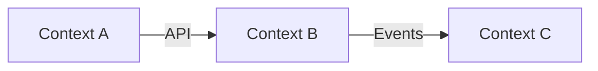

# Domain Model & Ubiquitous Language Template

```markdown
---
title: "[Project Name] — Domain Model"
status: draft
created: YYYY-MM-DD
updated: YYYY-MM-DD
authors: [name]
tags: [domain, language, model]
---

# Domain Model & Ubiquitous Language

This document defines the shared vocabulary and conceptual model for the project. Every term defined here is the canonical name used in code, documentation, UI copy, and conversation. Inconsistency between this document and any other artifact is a bug.

## How to Use This Document

- **Developers**: Use these exact terms in code (variable names, class names, database columns, API fields). If you need a new term, add it here first.
- **AI Agents**: Read this document before writing any code or documentation. Use these terms exactly. If a term seems wrong or missing, flag it — do not invent alternatives.
- **Stakeholders**: This is the shared language between business and engineering. If a term doesn't match your mental model, that's a conversation to have.

## Core Concepts

### [Entity Name]

- **Definition**: Plain-language description of what this is in the business domain.
- **Code representation**: Class/table/type name and location.
- **Lifecycle states**: List of valid states and transitions.
- **Key attributes**: Important properties with types and constraints.
- **Business rules**: Constraints and validations that apply to this entity.
- **Relationships**: How it connects to other entities.
- **Notes**: Edge cases, historical context, or common misconceptions.

<!-- Repeat for each core entity. Order by importance/centrality, not alphabetically. -->

## Bounded Contexts

A bounded context is a boundary within which a particular domain model applies. The same word might mean different things in different contexts.

### [Context Name]

- **Scope**: What part of the system this context covers.
- **Owned entities**: Which entities are authoritative in this context.
- **External dependencies**: Entities from other contexts this one references.
- **Communication pattern**: How this context talks to others (API calls, events, shared database, etc.).

## Context Map

How bounded contexts interact:



Describe each relationship: upstream/downstream, conformist/anticorruption layer/shared kernel.

## Domain Events

Events are state changes that matter to the business. They're past-tense facts.

| Event | Trigger | Emitted By | Consumed By | Payload |
|-------|---------|-----------|------------|---------|
| [EntityCreated] | When a new [entity] is ... | [Context] | [Contexts] | Key fields |

## Domain Rules

Business rules that span entities or contexts:

1. **[Rule Name]** — Description of the invariant. Reference the entities involved. State what happens when the rule is violated.

## Ubiquitous Language Glossary

Alphabetical quick-reference. For full definitions, see the Core Concepts section above.

| Term | Definition | Code Name | Avoid |
|------|-----------|-----------|-------|
| [Term] | Short definition | `codeName` | Don't call it [wrong term] |

The "Avoid" column lists common synonyms or legacy terms that should NOT be used. This helps AI agents and new team members avoid introducing inconsistency.

## Change Log

Track changes to the domain model over time:

| Date | Change | Reason | Author |
|------|--------|--------|--------|
| | | | |
```
