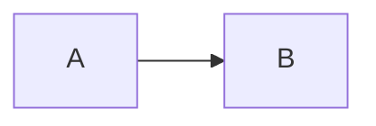

# Software Architecture Document

Standard: ISO/IEC/IEEE 42010:2022.

Path: `docs/sad.md`

A Software Architecture Document is an architecture description (AD): a work
product used to express an architecture (42010 3.3).

## Source Basis and Conformance Limits

Read this before generating or validating a SAD. It governs what the document is
allowed to claim.

| Element | Basis |
|---|---|
| Clause structure, all 19 definitions, Clause 4 conformance, Clauses 5.1 to 5.2.3 | Verified against the ISO publisher preview of 42010:2022 |
| Core ontology and cardinalities | Verified against the Ed2 core ontology published by the standard's editor, corroborated by Figure 1 of the preview |
| Individual requirements per clause | Recovered from the 42010:2011 AD template by Rich Hilliard, CC BY 3.0, http://www.iso-architecture.org/42010/templates/ |
| Clause 6.1 to 6.10 normative text | Not available. Behind the paywall from standard page 19 |

**42010 forbids tailoring.** Clause 4 states that tailoring is neither required
nor permitted when a conformance claim is made. Conformance is binary. This
differs from 29148, which has normative tailoring policies.

Therefore, until the normative text of Clause 6 is verified, a generated SAD
declares `conformance: not-claimed` and states that it is structured according to
42010:2022 Clause 6. It must not assert conformance. Do not soften this. Telling a
client a document is 42010-conformant when the requirements were inferred is a
false claim.

When the standard is obtained, reconcile each section against Clause 6, then
switch `conformance` to `conformant`.

## Known Edition Differences

42010:2011 required exactly one view per viewpoint. **42010:2022 changed this**:
a viewpoint governs one or more views. Checks must use "at least one", not
"exactly one".

Terminology that changed in Ed2 and must be used correctly:

| Ed2 term | Ed1 term |
|---|---|
| Entity of interest (EoI) | System of interest |
| Architecture description framework (ADF) | Architecture framework |
| View component | Architecture model |
| Stakeholder perspective | New in Ed2 |
| Architecture aspect | New in Ed2 |

Recording architecture decisions was a `should` in 2011. In 2022 it appears as
§6.10 inside the normative Clause 6 list, which suggests it was promoted to a
`shall`. This template treats it as required. The uncertainty is unresolved.

## Content Elements

| Clause | Element | Template section |
|---|---|---|
| 6.1 | Architecture description identification and overview | 1 |
| 6.2 | Identification of stakeholders | 2.1 |
| 6.3 | Identification of stakeholder perspectives | 2.2 |
| 6.4 | Identification of concerns | 2.3 |
| 6.5 | Identification of aspects | 2.5 |
| 6.6 | Inclusion of architecture viewpoints | 3 |
| 6.7 | Inclusion of architecture views | 4 |
| 6.8 | Inclusion of view components | 4.x.2 |
| 6.9 | Recording of architecture correspondences | 5 |
| 6.10 | Recording of architecture decisions and rationale | 6 |

## Identifiers

| Prefix | AD element |
|---|---|
| `STK-NNN` | Stakeholder |
| `PER-NNN` | Stakeholder perspective |
| `CNC-NNN` | Concern |
| `ASP-NNN` | Architecture aspect |
| `VP-NNN` | Architecture viewpoint |
| `VW-NNN` | Architecture view |
| `MK-NNN` | Model kind |
| `COR-NNN` | Correspondence |
| `INC-NNN` | Known inconsistency |
| `ADR-NNNN` | Architecture decision |

Same immutability rules as requirements: never renumber, never reuse, never
delete. See `SKILL.md`.

## Cardinality Rules

From the Ed2 core ontology. These are countable, so the checklist is arithmetic
rather than judgment.

| Relation | Cardinality |
|---|---|
| AD identifies entity of interest | exactly 1 |
| AD identifies stakeholders | 1 or more |
| AD identifies concerns | 1 or more |
| Stakeholder sees things from perspective | 1 or more |
| Perspective results in concerns | 1 or more |
| Concern is a matter of importance to stakeholders | 1 or more |
| Viewpoint frames concerns | 1 or more |
| Viewpoint governs views | 1 or more |
| View addresses concerns | 1 or more |
| View is composed of view components | 1 or more |
| Viewpoint has model kinds | 1 or more |
| Model kind governs view components | 1 or more |
| Concern is refined by aspects | 0 or more |

The load-bearing rule: **every concern must be framed by at least one viewpoint.**
An unframed concern means the AD identifies something stakeholders care about and
then never addresses it. Raise it as a Conformance finding.

## Default Viewpoint Set

The project default is 4+1. Declaring an established viewpoint set is the
intended use of 42010; Annex F shows existing frameworks conforming this way.

Each viewpoint below must be specified per clause 8.1 in section 3 of the
document. If a project's concerns are not all framed by these five, add a
viewpoint. Do not leave a concern unframed.

| ID | Viewpoint | Frames concerns about | Model kinds |
|---|---|---|---|
| VP-001 | Logical | What the system does for its users. Functional decomposition, domain structure | Component diagram, domain model |
| VP-002 | Process | Runtime behavior, concurrency, performance, scalability | Sequence diagram, state diagram |
| VP-003 | Development | Module organization, build structure, dependencies, team boundaries | Package diagram, dependency graph |
| VP-004 | Physical | Deployment topology, infrastructure, operational environment | Deployment diagram |
| VP-005 | Scenarios | How the other four fit together under real use. Validates the architecture | Use case model, scenario walkthrough |

All model kinds render as Mermaid.

## Default Concerns

42010 requires certain concerns to be considered and included when applicable.
These names may be adapted to the project.

- What are the purposes of the entity of interest?
- Is the architecture suitable for achieving those purposes?
- How feasible is it to construct and deploy?
- What are the risks and impacts to stakeholders across the life cycle?
- How is it to be maintained and evolved?

## Default Stakeholders

The following must be considered, and identified when applicable to the entity of
interest: users, operators, acquirers, owners, suppliers, developers, builders,
maintainers. Names should be adapted to the project.

## Template

```markdown
---
title: "<Project Name> - Software Architecture Document"
type: sad
status: draft
version: "0.1"
baseline: null
conformance: not-claimed
standard: "ISO/IEC/IEEE 42010:2022"
conformance-note: "Structured according to Clause 6. Normative text of Clause 6 not verified. See references/sad.md."
created: YYYY-MM-DD
updated: YYYY-MM-DD
authors: [name]
---

# Software Architecture Document

## Document Identification

| Field | Value |
|---|---|
| Project | |
| Document | Software Architecture Document |
| Version | 0.1 |
| Baseline | Not baselined |
| Standard | ISO/IEC/IEEE 42010:2022 |
| Conformance | Not claimed. Structured according to Clause 6. |
| Status | Draft |
| Date | YYYY-MM-DD |

## Revision History

| Version | Date | Baseline | Author | Change | AD elements affected | CR |
|---|---|---|---|---|---|---|
| 0.1 | YYYY-MM-DD | - | | Initial draft | - | - |

---

# 1. Introduction

<!-- 42010 6.1 -->

## 1.1 Architecture Description Identification

| Field | Value |
|---|---|
| Architecture name | |
| Entity of interest | |
| Environment | |

The entity of interest is the subject of this architecture description (42010
3.12). Exactly one.

## 1.2 Supplementary Information

Issue date, status, authors, reviewers, approving authority, issuing
organization, change history, scope, glossary, configuration management, and
references. 42010 does not define these; they are set by the project.

## 1.3 Overview

Essential points of the architecture and a summary of the entity of interest.
Purpose, scope, and context. Include a reader's guide to the rest of this
document.

## 1.4 Architecture Evaluations

Results of any evaluations performed on this architecture. State explicitly if
none have been performed.

| Evaluation | Method | Date | Outcome |
|---|---|---|---|

---

# 2. Stakeholders, Perspectives, Concerns and Aspects

## 2.1 Stakeholders

<!-- 42010 6.2. At least one. -->

| ID | Stakeholder | Description | Interest in the EoI |
|---|---|---|---|
| STK-001 | | | |

Consider and include when applicable: users, operators, acquirers, owners,
suppliers, developers, builders, maintainers.

## 2.2 Stakeholder Perspectives

<!-- 42010 6.3. New in Ed2. A perspective is a way of thinking about the entity
     of interest, especially as it relates to concerns (42010 3.18). Perspectives
     group concerns and thereby organize the viewpoints that frame them. -->

| ID | Perspective | Held by | Concerns it results in |
|---|---|---|---|
| PER-001 | | STK-001, STK-003 | CNC-001, CNC-004 |

Each stakeholder sees things from at least one perspective. Each perspective
results in at least one concern.

## 2.3 Concerns

<!-- 42010 6.4. At least one. -->

| ID | Concern | Perspective | Refined by aspects |
|---|---|---|---|
| CNC-001 | | PER-001 | ASP-002 |

Consider and include when applicable: purposes of the EoI, suitability of the
architecture for those purposes, feasibility of construction and deployment,
risks and impacts across the life cycle, maintenance and evolution.

## 2.4 Concern to Stakeholder Traceability

Every concern is a matter of importance to at least one stakeholder. Every
stakeholder holds at least one concern.

| | STK-001 | STK-002 | STK-003 |
|---|---|---|---|
| CNC-001 | x | | x |
| CNC-002 | | x | x |

## 2.5 Aspects

<!-- 42010 6.5. New in Ed2. An aspect is part of the entity's character or nature
     (42010 3.9), reflected in views. Aspects refine concern-to-view traceability. -->

| ID | Aspect | Refines concerns | Reflected in views |
|---|---|---|---|
| ASP-001 | | CNC-001 | VW-001, VW-003 |

State explicitly if no aspects are identified.

---

# 3. Architecture Viewpoints

<!-- 42010 6.6. Each viewpoint specified per clause 8.1. -->

## 3.1 Viewpoint Set and Rationale

The viewpoint set used in this AD, and why each was selected. 42010 requires a
rationale for each viewpoint used.

| ID | Viewpoint | Rationale for selection |
|---|---|---|
| VP-001 | Logical | |

## 3.2 Concern Framing Matrix

Every concern must be framed by at least one viewpoint. An unframed concern is a
conformance defect.

| | VP-001 | VP-002 | VP-003 | VP-004 | VP-005 |
|---|---|---|---|---|---|
| CNC-001 | x | | | | x |
| CNC-002 | | x | | x | |

Unframed concerns: none.

## 3.3 Viewpoint Specifications

<!-- Repeat for each viewpoint. Specification per 42010 clause 8.1. -->

### 3.3.1 VP-001: Logical

| Field | Value |
|---|---|
| Identifier | VP-001 |
| Overview | |
| Concerns framed | CNC-001, CNC-004 |
| Typical stakeholders | STK-001, STK-002 |
| Model kinds | MK-001 |
| Correspondence rules | |
| Source | Kruchten 4+1 |

#### Model Kind MK-001: <name>

| Field | Value |
|---|---|
| Identifier | MK-001 |
| Conventions | Notation, language, and rules for constructing view components of this kind |
| Operations | |
| Correspondence rules | |

---

# 4. Architecture Views

<!-- 42010 6.7. At least one view per viewpoint used. -->

## 4.1 VW-001: <View Name>

| Field | Value |
|---|---|
| Identifier | VW-001 |
| Governing viewpoint | VP-001 |
| Concerns addressed | CNC-001, CNC-004 |
| Aspects reflected | ASP-001 |
| Version | |

### 4.1.1 View Components

<!-- 42010 6.8. At least one. Each identifies its governing model kind, adheres
     to its conventions, and carries version identification. -->

#### VC: <name>

| Field | Value |
|---|---|
| Governing model kind | MK-001 |
| Version | |



### 4.1.2 Known Issues With This View

Discrepancies between this view and its viewpoint's conventions. Incomplete
items, open questions, exceptions, deviations. Open issues here often become
architecture decisions.

| Issue | Description | Resolution path |
|---|---|---|

---

# 5. Correspondences and Consistency

<!-- 42010 6.9 -->

## 5.1 Correspondences

A correspondence is an identified relation between two or more AD elements
(42010 3.11). An AD can itself be an AD element in another AD, which is how this
document relates to the SRS and SDD.

| ID | Relates | Type | Description |
|---|---|---|---|
| COR-001 | VW-001, srs.md FR-012 | satisfaction | The component satisfies the requirement |
| COR-002 | VW-001, VW-003 | consistency | Both depict the same component |

Correspondence types include equivalence, composition, refinement, consistency,
traceability, dependency, constraint, satisfaction, and obligation.

## 5.2 Correspondence Methods

<!-- 42010 6.9.3 -->

Methods governing the correspondences above, and whether each rule holds.

| Method | Rule | Holds | Violations |
|---|---|---|---|
| Requirement satisfaction | Every FR in srs.md corresponds to at least one view component | | |
| Concern framing | Every concern is framed by at least one viewpoint | | |

For each rule, record whether it is satisfied or record all known violations.

## 5.3 Known Inconsistencies

<!-- 42010 6.9.1. Recording known inconsistencies is required. -->

Consistent architecture descriptions are preferred, but resolving every
inconsistency is sometimes infeasible for reasons of time, effort, or missing
information. Record them rather than hiding them.

| ID | Inconsistency | Between | Severity | Finding | Status |
|---|---|---|---|---|---|
| INC-001 | | VW-001, VW-004 | | F-018 | Open |

Populated from unresolved Consistency findings raised by `/pi-docs-realign`.
State explicitly if none are known.

---

# 6. Architecture Decisions and Rationale

<!-- 42010 6.10 -->

## 6.1 Decision Register

Full decision records are held as immutable ADRs in `docs/adr/`. This register is
the AD's record of them, and is what satisfies 6.10.1. It is regenerated when
ADRs are added or superseded.

| ID | Decision | Status | Concerns | AD elements affected | Owner |
|---|---|---|---|---|---|
| ADR-0001 | | accepted | CNC-002 | VW-002, VW-004 | |

Decisions are recorded separately because this document is revised in place while
decision records must remain immutable. See `references/adr.md`.

## 6.2 Rationale

<!-- 42010 6.10.2 -->

Rationale records the explanation, justification, or reasoning behind decisions
made, and behind architectural alternatives not chosen. It must give evidence
that multiple architectures were considered.

Per-decision rationale lives in the ADR. Summarize architecture-wide reasoning
here: why this overall shape, what was rejected, and why.

### 6.2.1 Alternatives Considered

| Alternative architecture | Why not chosen | ADR |
|---|---|---|

---

# 7. Supporting Information

## 7.1 Traceability

### 7.1.1 Requirements to Architecture

| Requirement | View | View component | Correspondence |
|---|---|---|---|
| FR-012 | VW-001 | | COR-001 |

### 7.1.2 Architecture to Design

| View component | SDD section |
|---|---|

## 7.2 TBD Register

| TBD | Location | Blocks | Finding | Owner | Needed by |
|---|---|---|---|---|---|

## 7.3 Withdrawn AD Elements

| ID | Withdrawn in version | Reason | Superseded by |
|---|---|---|---|
```

## Validation Checklist

Findings go into an analysis report of type `verification`.

### Content (42010 Clause 6)

- [ ] 1.1 Architecture identified and exactly one entity of interest identified
- [ ] 1.2 Supplementary information present
- [ ] 1.4 Architecture evaluations included, or explicitly stated as none
- [ ] 2.1 Stakeholders identified, at least one
- [ ] 2.1 Default stakeholder classes considered: users, operators, acquirers, owners, suppliers, developers, builders, maintainers
- [ ] 2.2 Stakeholder perspectives identified
- [ ] 2.3 Concerns identified, at least one
- [ ] 2.3 Default concerns considered: purposes, suitability, feasibility, risks and impacts, maintenance and evolution
- [ ] 2.4 Concern to stakeholder traceability present
- [ ] 2.5 Aspects identified, or explicitly stated as none
- [ ] 3.1 Every viewpoint used has a specification and a selection rationale
- [ ] 3.3 Every viewpoint specified per clause 8.1, with model kinds and their conventions
- [ ] 4 Every view names its governing viewpoint
- [ ] 4.x.1 Every view component names its governing model kind and carries version identification
- [ ] 4.x.2 Known issues recorded per view, or explicitly stated as none
- [ ] 5.1 Correspondences identified with their participating AD elements
- [ ] 5.2 Every correspondence rule records whether it holds, or lists violations
- [ ] 5.3 Known inconsistencies recorded, or explicitly stated as none
- [ ] 6.1 Decision register present and complete against `docs/adr/`
- [ ] 6.2 Rationale present, with evidence that alternatives were considered

### Cardinality

- [ ] Exactly one entity of interest
- [ ] Every stakeholder sees things from at least one perspective
- [ ] Every perspective results in at least one concern
- [ ] Every concern matters to at least one stakeholder
- [ ] **Every concern is framed by at least one viewpoint**
- [ ] Every viewpoint governs at least one view (not exactly one; changed in Ed2)
- [ ] Every view addresses at least one concern
- [ ] Every view has at least one view component
- [ ] Every viewpoint has at least one model kind
- [ ] Every model kind governs at least one view component

### Identifier Integrity

- [ ] Every AD element has a unique identifier
- [ ] No identifier renumbered since the last baseline
- [ ] No withdrawn identifier reused
- [ ] Withdrawn elements retained and listed in 7.3
- [ ] Every correspondence names AD elements that exist

### Conformance Declaration

- [ ] `conformance` is `not-claimed` while Clause 6 normative text is unverified
- [ ] The document does not assert 42010 conformance anywhere in its body
- [ ] No tailoring record exists. 42010 Clause 4 prohibits tailoring

### Output Rules

- [ ] No emojis
- [ ] No em-dashes
- [ ] Diagrams are Mermaid

## Attribution

Requirement content recovered from the architecture description template for use
with ISO/IEC/IEEE 42010:2011 by Rich Hilliard, licensed CC BY 3.0.
http://www.iso-architecture.org/42010/templates/
