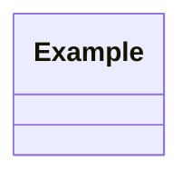

# Software Design Description

Standard: IEEE 1016-2009.

Path: `docs/sdd.md`

An SDD is a representation of a software design used to record design
information and communicate it to design stakeholders.

## Source Basis and Conformance Limits

**Read this first. The provenance here is weaker than any other document type in
this package.**

| Element | Basis |
|---|---|
| Clause structure, clause 4 required contents, clause 5 viewpoint list and sub-structure | Corroborated across three independent secondary sources |
| The four mandatory design attributes and their shall-statements | Recovered from a secondary source that appears to reproduce the standard |
| Twelve design viewpoint names | Confirmed by Wikipedia and corroborated by a university SDD example that applies nine of them |
| Any publisher preview | **None obtained.** IEEE is not ISO, so there is no iteh.ai style sample. Accuris and ANSI returned 403; IEEE Xplore returned 418 |
| Annex C template, conformance rules, per-viewpoint normative text | Not available |

Sources used were: an unlicensed public repository that appears to reproduce the
standard's text, a 2015 university SDD example that applies the 2009 viewpoint
model, and Wikipedia. No first-party publisher material was obtained for this
standard, unlike 29148, 29119-3 and 42010.

**A generated SDD declares `conformance: not-claimed`** and states that it is
structured according to IEEE 1016-2009. Do not assert conformance. Unlike 29148
and 29119-3, no conformance clause was located for 1016-2009, so the rules for
claiming conformance are themselves unknown.

Of the five document types, this is the one most worth buying the standard for.

## Wrong-Edition Warning

**IEEE 1016-1998 and IEEE 1016-2009 are structurally unrelated.** The 1998
edition prescribed fixed sections: System Architecture, Data Design, Component
Design, Human Interface Design. The 2009 revision discarded that and rebuilt the
standard around design viewpoints, aligned with the 1471/42010 view model.

Most "IEEE 1016 SDD templates" circulating online are 1998-shaped. If a template
has a "Human Interface Design" section and no viewpoints, it is the wrong
edition. Do not use it and do not let a user's existing template pull the
generated document back to the 1998 structure.

## Clause Structure

| Clause | Content |
|---|---|
| 1 | Overview: scope, purpose, intended audience, references |
| 2 | Definitions, acronyms and abbreviations |
| 3 | Conceptual model for software design descriptions |
| 4 | Design description information content. **The required contents** |
| 5 | Design viewpoints |

Clause 4 is the SDD specification, the same role Clause 6 plays in 42010 and
Clause 9.6 in 29148.

| Clause | Required content | Template section |
|---|---|---|
| 4.2 | SDD identification | 1 |
| 4.3 | Design stakeholders and their concerns | 2 |
| 4.4 | Design views | 4 |
| 4.5 | Design viewpoints | 3 |
| 4.6 | Design elements | within each view |
| 4.7 | Design overlays | 5 |
| 4.8 | Design rationale | 6 |
| 4.9 | Design languages | 1.5 |

## The Design Element Model

Clause 4.6 defines what a design view is made of. This is the part that makes an
SDD checkable.

| 4.6.x | Element | Rule |
|---|---|---|
| 4.6.1 | Design entity | The things being designed |
| 4.6.2 | Design attribute | A named characteristic of an element. All attributes declared by a viewpoint shall be specified |
| 4.6.3 | Design relationship | An association among two or more entities. Shall have a name and a type, and shall identify the participating entities |
| 4.6.4 | Design constraint | A rule imposed by one element (source) on another (target). Shall have a name and a type, and shall identify source and target |

### Mandatory Design Attributes

Every design element carries four attributes. These are countable, so the
checklist is arithmetic.

| Attribute | Requirement |
|---|---|
| **Name** (4.6.2.1) | Every design element shall have an unambiguous reference name |
| **Type** (4.6.2.2) | Shall describe the nature of the element. Chosen element types shall be applied consistently within the SDD |
| **Purpose** (4.6.2.3) | Shall provide the rationale for the creation of the element |
| **Author** (4.6.2.4) | Shall identify the designer of the element |

The Purpose attribute is the one teams skip. It is not a description of what the
element does; it is why the element exists at all. An entity whose Purpose cannot
be stated is probably not needed.

The standard predefines no design relationships and no design constraints.
Viewpoints introduce them.

## The Twelve Design Viewpoints

Clause 5. Each is specified with design concerns, design elements, and example
languages.

| Clause | Viewpoint | Addresses | Default |
|---|---|---|---|
| 5.2 | Context | System boundary, actors, offered services, information flows in and out. Design subject as a black box | Yes |
| 5.3 | Composition | Decomposition into parts, build and assembly structure | Yes |
| 5.4 | Logical | Static structure: classes, types, their relationships | Yes |
| 5.5 | Dependency | Interconnection and coupling between elements | Yes |
| 5.6 | Information | Persistent data structure, schema, retention | Yes |
| 5.7 | Patterns use | Design patterns and frameworks applied, and where | When used |
| 5.8 | Interface | Interfaces provided and required, signatures, protocols | Yes |
| 5.9 | Structure | Internal construction of an element | When needed |
| 5.10 | Interaction | Runtime message flow and collaboration between entities | Yes |
| 5.11 | State dynamics | States, transitions, events, and the conditions that drive them | Yes |
| 5.12 | Algorithm | Procedural logic and processing detail for non-obvious algorithms | When needed |
| 5.13 | Resource | Resources used and managed: memory, threads, connections, quotas | When constrained |

Users of the standard are not limited to these and may define their own.

The default set is eight: Context, Composition, Logical, Dependency,
Information, Interface, Interaction, State dynamics. Add Patterns use, Structure,
Algorithm and Resource when the design subject warrants it, and record the choice
as design rationale.

**Every design concern must be addressed by at least one design view.** Same
load-bearing rule as the SAD. A concern nobody addresses is a defect.

## Relationship to the Other Documents

The SDD sits below the SAD and above the code.

| Direction | Link |
|---|---|
| Up, to the SAD | Design entities refine SAD view components. Record as a 42010 correspondence in the SAD |
| Up, to the SRS | Every design entity traces to the requirements it helps satisfy |
| Down, to the STP | Design detail informs test design, though the test basis stays the SRS |

Do not restate architecture in the SDD. If a statement would be equally at home
in the SAD, it belongs in the SAD and the SDD should reference it. The division:
the SAD frames stakeholder concerns through viewpoints; the SDD specifies the
elements a programmer implements.

## Identifiers

| Prefix | Element |
|---|---|
| `DSTK-NNN` | Design stakeholder |
| `DCN-NNN` | Design concern |
| `DVP-NNN` | Design viewpoint |
| `DVW-NNN` | Design view |
| `DE-NNN` | Design entity |
| `DR-NNN` | Design relationship |
| `DCON-NNN` | Design constraint |
| `DOV-NNN` | Design overlay |

Same immutability rules as requirements. See `SKILL.md`.

Design stakeholders and concerns may differ from the SAD's. Where they are the
same, record a correspondence rather than duplicating the identifier.

## Template

```markdown
---
title: "<Project Name> - Software Design Description"
type: sdd
status: draft
version: "0.1"
baseline: null
conformance: not-claimed
standard: "IEEE 1016-2009"
conformance-note: "Structured according to IEEE 1016-2009 clause 4. No first-party source obtained. See references/sdd.md."
created: YYYY-MM-DD
updated: YYYY-MM-DD
authors: [name]
---

# Software Design Description

# 1. SDD Identification

<!-- IEEE 1016-2009 4.2 -->

| Field | Value |
|---|---|
| Design subject | |
| Document | Software Design Description |
| Version | 0.1 |
| Baseline | Not baselined |
| Standard | IEEE 1016-2009 |
| Conformance | Not claimed. Structured according to clause 4. |
| Status | Draft |
| Date | YYYY-MM-DD |
| Authors | |

## 1.1 Scope

What this design covers and what it does not.

## 1.2 Purpose

Why this document exists and who it is for.

## 1.3 References

| Reference | Title | Version |
|---|---|---|
| srs.md | Software Requirements Specification | |
| sad.md | Software Architecture Document | |

## 1.4 Definitions and Acronyms

| Term | Definition |
|---|---|

## 1.5 Design Languages

<!-- 4.9 -->

The notations used in this SDD and where each applies.

| Language or notation | Used in | Convention |
|---|---|---|
| Mermaid class diagram | Logical view | UML class semantics |

## 1.6 Change History

| Version | Date | Baseline | Author | Change | Elements affected | CR |
|---|---|---|---|---|---|---|
| 0.1 | YYYY-MM-DD | - | | Initial draft | - | - |

---

# 2. Design Stakeholders and Concerns

<!-- IEEE 1016-2009 4.3. An SDD shall identify the design stakeholders and the
     design concerns of each. -->

## 2.1 Design Stakeholders

| ID | Stakeholder | Role in the design | SAD correspondence |
|---|---|---|---|
| DSTK-001 | | | STK-002 |

## 2.2 Design Concerns

| ID | Concern | Held by | Addressed by views |
|---|---|---|---|
| DCN-001 | | DSTK-001 | DVW-001, DVW-004 |

## 2.3 Concern Coverage

Every concern must be addressed by at least one view.

| | DVW-001 | DVW-002 | DVW-003 |
|---|---|---|---|
| DCN-001 | x | | x |

Unaddressed concerns: none.

---

# 3. Design Viewpoints

<!-- IEEE 1016-2009 4.5 and clause 5. -->

The viewpoints used in this SDD, and why each was selected.

| ID | Viewpoint | Clause | Concerns framed | Rationale for selection |
|---|---|---|---|---|
| DVP-001 | Context | 5.2 | DCN-001 | |

Viewpoints considered and not used, with reasons:

| Viewpoint | Reason not used |
|---|---|
| Algorithm | No non-obvious algorithms in this design subject |

---

# 4. Design Views

<!-- IEEE 1016-2009 4.4. One section per view. -->

## 4.1 DVW-001: <View Name>

| Field | Value |
|---|---|
| Identifier | DVW-001 |
| Governing viewpoint | DVP-001 |
| Concerns addressed | DCN-001 |
| SAD correspondence | VW-002 |

### 4.1.1 Diagram



### 4.1.2 Design Entities

<!-- 4.6.1. Every entity carries the four mandatory attributes from 4.6.2. -->

#### DE-001: <Entity Name>

| Attribute | Value |
|---|---|
| Name | DE-001 <Entity Name> |
| Type | Component |
| Purpose | Why this entity exists |
| Author | |
| Satisfies | FR-012, NFR-PERF-003 |
| Refines | sad.md VW-002 |

Description, responsibilities, and behavior.

### 4.1.3 Design Relationships

<!-- 4.6.3. Each shall have a name, a type, and shall identify participants. -->

| ID | Name | Type | Participants |
|---|---|---|---|
| DR-001 | | composition | DE-001, DE-004 |

### 4.1.4 Design Constraints

<!-- 4.6.4. Each shall have a name, a type, and shall identify source and target. -->

| ID | Name | Type | Source | Target |
|---|---|---|---|---|
| DCON-001 | | invariant | DE-001 | DE-004 |

---

# 5. Design Overlays

<!-- IEEE 1016-2009 4.7. A mechanism for presenting additional design information
     over existing views. Omit if none. -->

| ID | Overlay | Applies to | Information added |
|---|---|---|---|
| DOV-001 | | DVW-001 | |

State explicitly if no overlays are used.

---

# 6. Design Rationale

<!-- IEEE 1016-2009 4.8. The reasoning that led to the design as specified:
     options, trade-offs considered, decisions made, and their justification. -->

## 6.1 Key Design Decisions

Decisions at architecture level belong in ADRs. Record here the design-level
reasoning that shaped entities and relationships.

| Decision | Options considered | Trade-off | Chosen because | ADR |
|---|---|---|---|---|

## 6.2 Viewpoint Selection Rationale

Why this viewpoint set, and why the unused ones were excluded.

---

# 7. Supporting Information

## 7.1 Traceability

### 7.1.1 Requirements to Design Entities

| Requirement | Design entities | View |
|---|---|---|
| FR-012 | DE-001, DE-007 | DVW-002 |

### 7.1.2 Architecture to Design

| SAD view component | Design entities |
|---|---|

## 7.2 TBD Register

| TBD | Location | Blocks | Finding | Owner | Needed by |
|---|---|---|---|---|---|

## 7.3 Withdrawn Elements

| ID | Withdrawn in version | Reason | Superseded by |
|---|---|---|---|
```

## Validation Checklist

Findings go into an analysis report of type `verification`.

### Required Contents (IEEE 1016-2009 clause 4)

- [ ] 4.2 SDD identification present
- [ ] 4.3 Design stakeholders identified
- [ ] 4.3 Design concerns identified, each attributed to at least one stakeholder
- [ ] 4.4 Design views present
- [ ] 4.5 Design viewpoints identified, each with a selection rationale
- [ ] 4.6 Design elements present within each view
- [ ] 4.7 Design overlays present, or explicitly stated as none
- [ ] 4.8 Design rationale present
- [ ] 4.9 Design languages named, with their conventions

### Design Element Integrity (clause 4.6)

For every design entity:

- [ ] **Name**: unambiguous reference name
- [ ] **Type**: describes the nature of the element
- [ ] **Purpose**: states why the element exists, not what it does
- [ ] **Author**: identifies the designer
- [ ] All attributes declared by the governing viewpoint are specified

For every design relationship:

- [ ] Has a name and a type
- [ ] Identifies every participating design entity, and each exists

For every design constraint:

- [ ] Has a name and a type
- [ ] Identifies both source and target, and each exists

Across the document:

- [ ] **Element types are applied consistently.** The same word means the same kind of thing throughout

### Viewpoint and View Coverage

- [ ] Every view names its governing viewpoint
- [ ] Every viewpoint used has at least one view
- [ ] **Every design concern is addressed by at least one view**
- [ ] Viewpoints considered and rejected are listed with reasons

### Edition Discipline

- [ ] The document is viewpoint-structured, not 1998-structured
- [ ] No section named "Human Interface Design", "Data Design", or "Component Design" as a top-level structure. Those belong to the withdrawn 1998 edition

### Traceability

- [ ] Every design entity traces to at least one requirement, or records why it is derived
- [ ] Every design entity that refines a SAD view component names it
- [ ] No citation points to a non-existent identifier

### Boundary Discipline

- [ ] No content that belongs in the SAD is restated here
- [ ] Architecture-level decisions are in ADRs, not in section 6

### Conformance Declaration

- [ ] `conformance` is `not-claimed`
- [ ] The document does not assert IEEE 1016 conformance anywhere in its body

### Output Rules

- [ ] No emojis
- [ ] No em-dashes
- [ ] Diagrams are Mermaid
