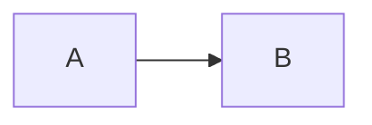

# Stakeholder Requirements Specification

Standard: ISO/IEC/IEEE 29148:2018.

Path: `docs/strs.md`

An StRS is a structured collection of the requirements of the stakeholders and
the relationship to the external environment (29148 3.1.29).

## Why This Document Exists

The StRS records what stakeholders need, **in their language**, before it is
transformed into statements about what software shall do.

Its practical value is evidential. When a client says "that is not what we asked
for", an SRS full of shall-statements is an argument. An StRS quoting their
stated need, traced backward to the source it came from and forward to the
software requirements derived from it, is a record.

29148 defines four requirements information items. This is the second.

| Clause | Item | Level |
|---|---|---|
| 9.3 | Business requirements specification | The business case |
| 9.4 | **Stakeholder requirements specification** | What stakeholders need |
| 9.5 | System requirements specification | System level |
| 9.6 | Software requirements specification | What the software shall do |

## Source Basis

| Element | Basis |
|---|---|
| Clause 9.4 content elements 9.4.1 to 9.4.19 | Verified against the ISO publisher preview of 29148:2018 |
| Requirement characteristics, language criteria, attributes | Verified, 29148 5.2.5 to 5.2.8 |
| Annex A, system operational concept, normative | Title verified. Content not available |
| The StRS example outline at 8.3.2 | Not available |

Same note as the SRS: the section numbering below carries all nineteen 9.4
content elements but is not a reproduction of the 8.3.2 example outline. Reconcile
and record as tailoring if the full standard is obtained.

## The Requirement Chain

Stakeholder requirements are the parents of software requirements. 29148 3.1.10
defines a derived requirement as one deduced or inferred from the collection and
organization of requirements, with the higher-level requirement called the parent
and the lower-level one the child.

```
source material
   |
   S-NNN     source statement, verbatim from the source
   |
   STR-NNN   stakeholder requirement, the need in the stakeholder's terms
   |
   FR-NNN    software requirement, what the software shall do about it
   NFR-NNN
   CON-NNN
```

Both hops are checkable in both directions:

- Every `S-NNN` dispositioned as `requirement` resolves to an `STR-NNN`
- Every `STR-NNN` cites the `S-NNN` it came from, or is marked derived
- Every `STR-NNN` has at least one child software requirement, or a recorded
  reason it has none
- Every `FR-NNN` and `NFR-NNN` names its parent `STR-NNN`

An `STR-NNN` with no children is an unmet need. An `FR-NNN` with no parent is
work nobody asked for. Both are Coverage findings.

### The Discipline That Makes This Worth Doing

A stakeholder requirement states the **need**. A software requirement states what
the software **does about it**. If the two are the same sentence with different
identifiers, the StRS is padding and should be dropped.

```
STR-012  Sales staff need to reach customer history while on a call,
         without leaving the phone system.
         Source: S-004 (Kickoff transcript 2026-07-14)

FR-CRM-003  The system shall display the customer history panel within
            2 seconds of an inbound call being answered.
            Parent: STR-012

FR-CRM-004  The system shall render the customer history panel inside
            the telephony client rather than a separate window.
            Parent: STR-012
```

One need, two software requirements, and the reason each exists is legible.

Stakeholder requirements still obey the 29148 5.2.5 characteristics. **Appropriate**
does the work here: the right level of abstraction for the stakeholder level, with
no implementation detail and no software design.

## Identifiers

| Prefix | Element |
|---|---|
| `STR-NNN` | Stakeholder requirement |
| `SHR-NNN` | Stakeholder |
| `OPS-NNN` | Operational scenario |
| `PCON-NNN` | Project constraint |

Same immutability rules as all identifiers. Never renumber, never reuse, never
delete. Withdrawn stakeholder requirements stay in place, and any software
requirement whose parent is withdrawn becomes a Currency finding.

## Content Elements

29148 9.4 defines nineteen content elements. The template covers all nineteen in
clause order.

| Clause | Element | Section |
|---|---|---|
| 9.4.1 | StRS overview | 1.1 |
| 9.4.2 | Stakeholder purpose | 1.2 |
| 9.4.3 | Stakeholder scope | 1.3 |
| 9.4.4 | Overview | 1.4 |
| 9.4.5 | Stakeholders | 2 |
| 9.4.6 | Business environment | 3.1 |
| 9.4.7 | Mission, goals and objectives | 3.2 |
| 9.4.8 | Business model | 3.3 |
| 9.4.9 | Information environment | 3.4 |
| 9.4.10 | System processes | 4.1 |
| 9.4.11 | System operational policies and rules | 4.2 |
| 9.4.12 | Operational constraints | 4.3 |
| 9.4.13 | System operational modes and states | 4.4 |
| 9.4.14 | System operational quality | 4.5 |
| 9.4.15 | User requirements | 5 |
| 9.4.16 | Operational concept | 6.1 |
| 9.4.17 | Operational scenarios | 6.2 |
| 9.4.18 | Other detailed concepts of proposed system | 6.3 |
| 9.4.19 | Project constraints | 7 |

## Requirement Format

```markdown
#### STR-012: Reach customer history during a call

**Sales staff need to reach customer history while on a call, without leaving
the phone system.**

| Attribute | Value |
|---|---|
| Identifier | STR-012 |
| Stakeholder | SHR-002 Sales team |
| Rationale | Context switching during live calls loses the customer's attention. |
| Source | S-004 (Kickoff transcript 2026-07-14) |
| Priority | Must |
| Children | FR-CRM-003, FR-CRM-004 |
| Status | Proposed |
```

`Source` cites an `S-NNN` from an analysis report. A requirement with no source
and no derivation is unjustified; if it came from engineering judgment, say
`Derived (engineering judgment)` explicitly.

## Template

```markdown
---
title: "<Project Name> - Stakeholder Requirements Specification"
type: strs
status: draft
version: "0.1"
baseline: null
conformance: full
standard: "ISO/IEC/IEEE 29148:2018"
created: YYYY-MM-DD
updated: YYYY-MM-DD
authors: [name]
---

# Stakeholder Requirements Specification

## Document Identification

| Field | Value |
|---|---|
| Project | |
| Document | Stakeholder Requirements Specification |
| Version | 0.1 |
| Baseline | Not baselined |
| Standard | ISO/IEC/IEEE 29148:2018 |
| Conformance | Full |
| Status | Draft |
| Date | YYYY-MM-DD |

## Revision History

| Version | Date | Baseline | Author | Change | Requirements affected | CR |
|---|---|---|---|---|---|---|
| 0.1 | YYYY-MM-DD | - | | Initial draft | - | - |

---

# 1. Introduction

## 1.1 StRS Overview

<!-- 29148 9.4.1 -->

What this document contains, how it is organized, and the standard followed.

## 1.2 Stakeholder Purpose

<!-- 29148 9.4.2 -->

Why the stakeholders want this system. The outcome they are buying, not the
software they are commissioning.

## 1.3 Stakeholder Scope

<!-- 29148 9.4.3 -->

Whose needs this document covers, and whose it does not.

### 1.3.1 Out of Scope

| Stakeholder or need | Reason |
|---|---|

## 1.4 Overview

<!-- 29148 9.4.4 -->

Summary of the proposed system from the stakeholder's point of view.

---

# 2. Stakeholders

<!-- 29148 9.4.5 -->

| ID | Stakeholder | Role | Interest in the system | Influence |
|---|---|---|---|---|
| SHR-001 | | | | |

Every stakeholder requirement names at least one stakeholder here. A stakeholder
with no requirements either has none, which should be stated, or was not
interviewed, which is a finding.

---

# 3. Business Context

## 3.1 Business Environment

<!-- 29148 9.4.6 -->

The organizational and market context the system operates within.

## 3.2 Mission, Goals and Objectives

<!-- 29148 9.4.7 -->

| ID | Goal | Measure of success | Related requirements |
|---|---|---|---|

## 3.3 Business Model

<!-- 29148 9.4.8 -->

How the organization creates and captures value, insofar as the system affects
it.

## 3.4 Information Environment

<!-- 29148 9.4.9 -->

What information the organization holds, where it lives, and what governs it.

---

# 4. Operational Context

## 4.1 System Processes

<!-- 29148 9.4.10 -->

The business processes the system participates in.



## 4.2 System Operational Policies and Rules

<!-- 29148 9.4.11 -->

| ID | Policy or rule | Source | Effect on the system |
|---|---|---|---|

## 4.3 Operational Constraints

<!-- 29148 9.4.12 -->

Constraints on how the system may operate. Distinguish from project constraints
in section 7, which bound the work rather than the system.

## 4.4 System Operational Modes and States

<!-- 29148 9.4.13 -->

| Mode or state | Description | Entered when | Exited when |
|---|---|---|---|

## 4.5 System Operational Quality

<!-- 29148 9.4.14 -->

Qualities stakeholders expect in operation, stated as they state them. These
become non-functional requirements downstream, so record the expectation here and
the metric in the SRS.

| Quality | Stakeholder expectation | Becomes |
|---|---|---|
| Responsiveness | Screens feel instant during a call | NFR-PERF-001 |

---

# 5. Stakeholder Requirements

<!-- 29148 9.4.15 user requirements -->

Organize by stakeholder group or by business process. State the requirement
format above for each.

## 5.1 <Stakeholder Group or Process>

<!-- Repeat the requirement format for each STR. -->

---

# 6. Operational Concept

## 6.1 Operational Concept

<!-- 29148 9.4.16. See also 29148 Annex A, normative, system operational concept. -->

How the system will be used in practice, from the operator and user point of
view.

## 6.2 Operational Scenarios

<!-- 29148 9.4.17 -->

Narrative walkthroughs of real use. These become the SAD Scenarios viewpoint and
seed test design.

### OPS-001: <Scenario name>

| Field | Value |
|---|---|
| Identifier | OPS-001 |
| Actors | SHR-002 |
| Trigger | |
| Preconditions | |
| Requirements exercised | STR-012, STR-015 |

Narrative, in sequence.

## 6.3 Other Detailed Concepts

<!-- 29148 9.4.18 -->

Anything else about the proposed system stakeholders need recorded. State
explicitly if none.

---

# 7. Project Constraints

<!-- 29148 9.4.19 -->

Constraints on the work rather than on the system: budget, schedule, mandated
technology, contractual obligations, available staff.

| ID | Constraint | Source | Effect |
|---|---|---|---|
| PCON-001 | | | |

---

# 8. Supporting Information

## 8.1 TBD Register

| TBD | Location | Blocks | Finding | Owner | Needed by |
|---|---|---|---|---|---|

## 8.2 Traceability

### 8.2.1 Upward, Source to Stakeholder Requirement

| Source statement | Stakeholder requirement |
|---|---|
| S-004 | STR-012 |

### 8.2.2 Downward, Stakeholder Requirement to Software Requirement

| Stakeholder requirement | Children | Status |
|---|---|---|
| STR-012 | FR-CRM-003, FR-CRM-004 | Allocated |

Stakeholder requirements with no children: none.

## 8.3 Tailoring Record

<!-- 29148 Annex C. Required only if conformance is declared as tailored. -->

| Clause | Element omitted | Reason |
|---|---|---|

## 8.4 Withdrawn Requirements

| Requirement | Withdrawn in version | Reason | Superseded by |
|---|---|---|---|
```

## Validation Checklist

### Content Conformance (29148 9.4)

- [ ] 9.4.1 StRS overview
- [ ] 9.4.2 Stakeholder purpose, stated as an outcome not a system
- [ ] 9.4.3 Stakeholder scope, with an explicit out-of-scope list
- [ ] 9.4.4 Overview
- [ ] 9.4.5 Stakeholders
- [ ] 9.4.6 Business environment
- [ ] 9.4.7 Mission, goals and objectives
- [ ] 9.4.8 Business model
- [ ] 9.4.9 Information environment
- [ ] 9.4.10 System processes
- [ ] 9.4.11 System operational policies and rules
- [ ] 9.4.12 Operational constraints
- [ ] 9.4.13 System operational modes and states
- [ ] 9.4.14 System operational quality
- [ ] 9.4.15 User requirements
- [ ] 9.4.16 Operational concept
- [ ] 9.4.17 Operational scenarios
- [ ] 9.4.18 Other detailed concepts, or explicitly stated as none
- [ ] 9.4.19 Project constraints
- [ ] Any omitted element appears in the tailoring record with a reason

### Individual Requirement Characteristics (29148 5.2.5)

- [ ] **Necessary**, **unambiguous**, **complete**, **singular**, **feasible**, **verifiable**, **correct**, **conforming**
- [ ] **Appropriate**: stated at stakeholder level. No implementation, no software design, no interface detail

### Requirement Set Characteristics (29148 5.2.6)

- [ ] **Complete**, **consistent**, **feasible**, **comprehensible**, **able to be validated**

### The Chain

- [ ] Every `STR-NNN` cites an `S-NNN`, or is explicitly marked derived
- [ ] Every `S-NNN` dispositioned as `requirement` resolves to an `STR-NNN`
- [ ] **Every `STR-NNN` has at least one child software requirement, or a recorded reason it has none**
- [ ] **Every `FR-NNN` and `NFR-NNN` in the SRS names a parent `STR-NNN`**
- [ ] No stakeholder requirement restates its child verbatim. If need and behaviour are the same sentence, one of them is padding
- [ ] Every stakeholder in section 2 has at least one requirement, or a recorded reason they have none
- [ ] No requirement names a stakeholder absent from section 2

### Identifier Integrity

- [ ] Every requirement has a unique identifier
- [ ] No identifier renumbered since the last baseline
- [ ] No withdrawn identifier reused
- [ ] Withdrawn requirements retained and listed in 8.4
- [ ] No child requirement whose parent has been withdrawn

### Output Rules

- [ ] No emojis
- [ ] No em-dashes
- [ ] Diagrams are Mermaid
